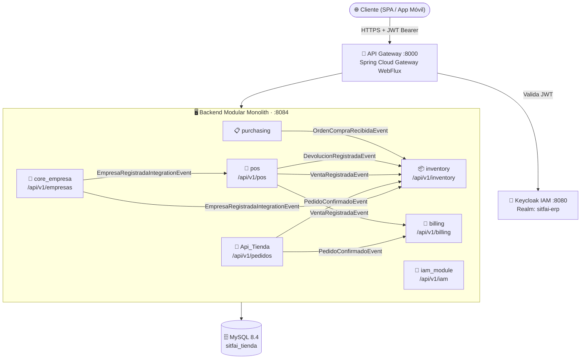
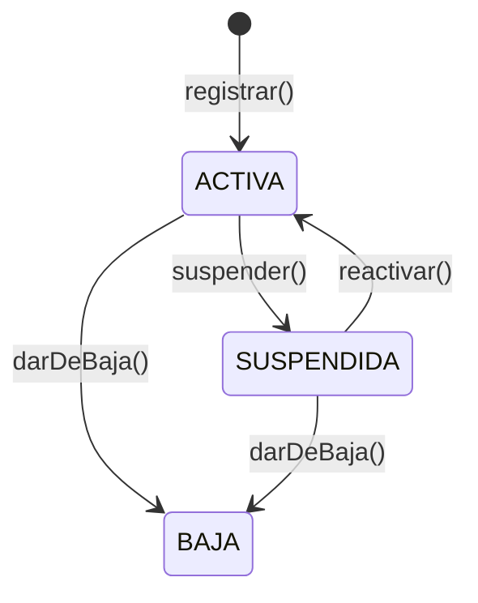
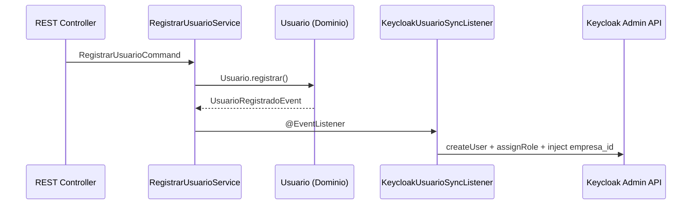
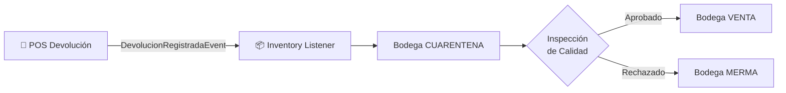
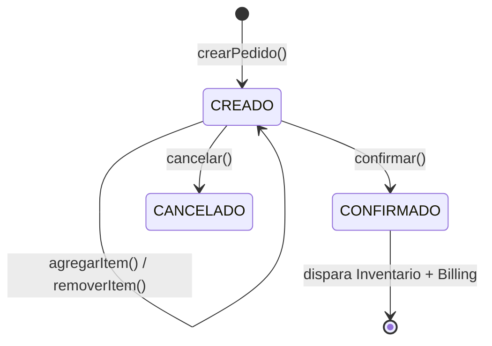
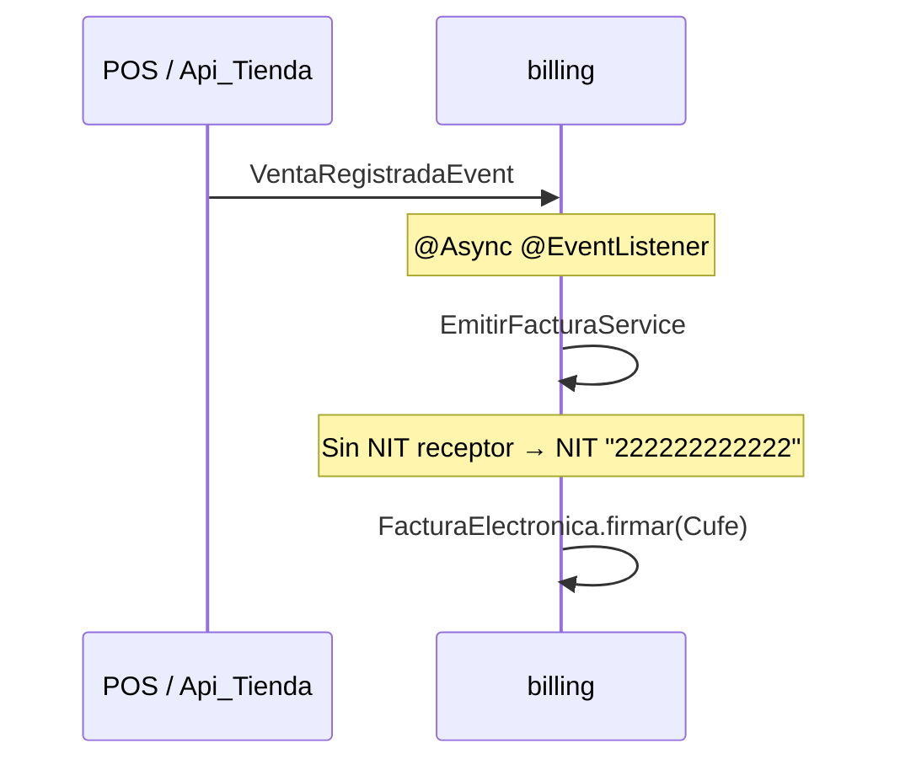
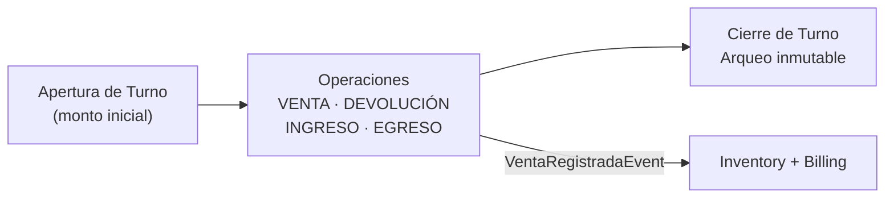
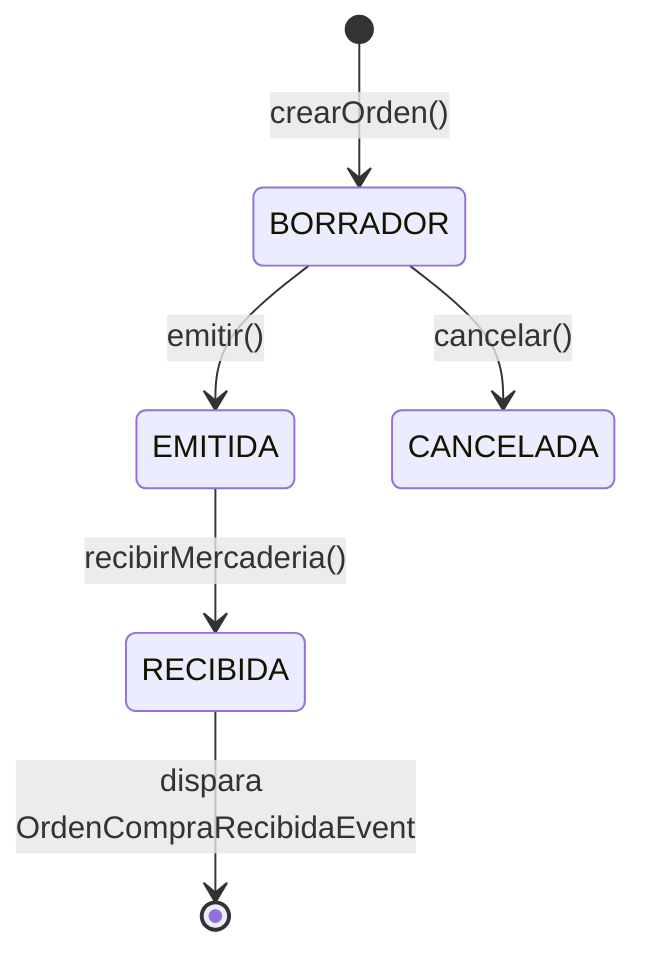
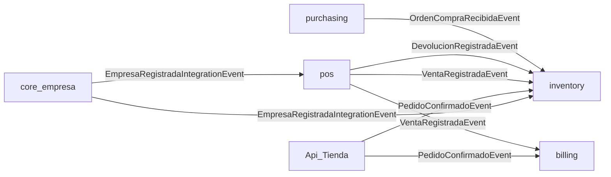

# 🏢 SITFAI ERP

<div align="center">

**Sistema Integrado de Gestión Empresarial · Arquitectura Hexagonal · DDD · Multitenancy SaaS**

[](https://openjdk.org/projects/jdk/21/)
[](https://spring.io/projects/spring-boot)
[](https://spring.io/projects/spring-cloud)
[](https://www.mysql.com/)
[](https://www.keycloak.org/)
[](https://docs.docker.com/compose/)

</div>

---

## Tabla de Contenidos

- [Descripción General](#-descripción-general)
- [Arquitectura del Sistema](#-arquitectura-del-sistema)
- [Mapa de Bounded Contexts](#-mapa-de-bounded-contexts)
- [Módulos](#-módulos)
- [Flujos de Integración Event-Driven](#-flujos-de-integración-event-driven)
- [Mapa de Puertos y Rutas](#-mapa-de-puertos-y-rutas)
- [Stack Tecnológico](#-stack-tecnológico)
- [Prerrequisitos](#-prerrequisitos)
- [Instalación y Ejecución](#-instalación-y-ejecución)
- [Variables de Entorno](#-variables-de-entorno)
- [Pruebas Automatizadas](#-pruebas-automatizadas)
- [Pruebas E2E](#-pruebas-e2e)
- [Decisiones Arquitectónicas ADR](#-decisiones-arquitectónicas-adr)

---

## 📖 Descripción General

**SITFAI ERP** es una plataforma SaaS multitenant de gestión empresarial construida sobre **Clean Architecture**, **Arquitectura Hexagonal (Ports & Adapters)** y **Domain-Driven Design (DDD)**. Está diseñada para empresas colombianas que requieren:

- ✅ **Multitenancy estricto** — aislamiento total de datos por empresa (`empresa_id`)
- ✅ **Facturación Electrónica DIAN** — emisión de comprobantes fiscales con CUFE
- ✅ **Control de Inventario** — bodega, stock, logística inversa y cuarentena
- ✅ **POS integrado** — cajas, turnos, arqueos y ventas en tiempo real
- ✅ **Compras y Reabastecimiento** — órdenes de compra con ciclo completo
- ✅ **Seguridad Zero Trust** — autenticación delegada a Keycloak (cero contraseñas en BD)

---

## 🏛️ Arquitectura del Sistema

El sistema sigue el principio cardinal: **las dependencias siempre apuntan hacia adentro (hacia el Dominio)**.

```
┌─────────────────────────────────────────────────────────────────────┐
│                      INFRASTRUCTURE LAYER                            │
│   Adaptadores: JPA · REST Controllers · Spring Events · Keycloak    │
├─────────────────────────────────────────────────────────────────────┤
│                      APPLICATION LAYER                               │
│         Use Cases · Application Services · Commands · Queries        │
├─────────────────────────────────────────────────────────────────────┤
│                        DOMAIN LAYER                                  │
│  Aggregates · Entities · Value Objects · Domain Events · Ports       │
│           ⚡ Cero dependencias a frameworks externos ⚡               │
└─────────────────────────────────────────────────────────────────────┘
```

### Estructura de paquetes por módulo

```
com.SITFAI_CORE_ERP_TIENDA.{modulo}/
├── domain/
│   ├── model/          # Aggregates, Entities, Value Objects
│   ├── event/          # Domain Events (records inmutables)
│   ├── exception/      # Domain Exceptions (sin frameworks)
│   ├── service/        # Domain Services (lógica sin estado)
│   └── port/
│       ├── input/      # Use Case interfaces (Driving Ports)
│       └── output/     # Repository & Event Publisher interfaces
├── application/
│   ├── service/        # Implementaciones de Use Cases
│   ├── dto/            # Command/Query DTOs
│   └── mapper/         # Mappers Dominio ↔ DTO
└── infrastructure/
    ├── adapter/
    │   ├── in/web/     # REST Controllers
    │   └── out/
    │       ├── persistence/  # JPA Entities, Spring Data Repos
    │       └── event/        # Spring Event Publishers
    └── config/         # Spring @Configuration
```

---

## 🗺️ Mapa de Bounded Contexts



---

## 📦 Módulos

### 1. API Gateway (Perimetral)

> **Puerto:** `8000` | **Framework:** Spring Cloud Gateway + WebFlux | **Estado:** 🟢 OPERATIVO

Punto único de entrada. Valida tokens JWT de Keycloak antes de reenviar cualquier petición.

| Ruta de Entrada | Servicio Destino |
|---|---|
| `/api/v1/empresas/**` | `core_empresa` (:8081) |
| `/api/v1/inventory/**` | `inventory` (:8083) |
| `/api/v1/pedidos/**` | `Api_Tienda` (:8084) |
| `/api/v1/billing/**` | `billing` (:8085) |
| `/api/v1/pos/**` | `pos` (:8086) |

---

### 2. `core_empresa` — Tenant Raíz

> **Puerto:** `8081` | **Estado:** 🟢 COMPLETADO (v1.1.0)

La entidad raíz del SaaS. Todos los datos del sistema pertenecen a una `Empresa`.

**Aggregate Root:** `Empresa` | **Ciclo de vida:** `ACTIVA → SUSPENDIDA → BAJA`



**Endpoints REST:**

| Método | Endpoint | Rol |
|--------|----------|-----|
| `POST` | `/api/v1/empresas` | `SUPER_ADMIN` |
| `GET` | `/api/v1/empresas` | `SUPER_ADMIN` |
| `GET` | `/api/v1/empresas/{id}` | `SUPER_ADMIN` |
| `GET` | `/api/v1/empresas/ruc/{ruc}` | `SUPER_ADMIN` |
| `PATCH` | `/api/v1/empresas/{id}/estado` | `SUPER_ADMIN` |
| `POST` | `/api/v1/empresas/{id}/sucursales` | `EMPRESA_ADMIN` |
| `GET` | `/api/v1/empresas/{id}/sucursales` | `EMPRESA_ADMIN` |
| `PATCH` | `/api/v1/empresas/{id}/sucursales/{sid}/estado` | `EMPRESA_ADMIN` |

**Eventos publicados:** `EmpresaCreadaEvent`, `EmpresaSuspendidaEvent`, `SucursalAgregadaEvent`, etc.

---

### 3. `iam_module` — Identidad y Acceso

> **Puerto:** `8082` | **Estado:** 🟢 COMPLETADO (185 tests)

Gestiona usuarios de cada tenant. **Las contraseñas nunca se persisten en BD** — Keycloak es el único IAM.

**Roles del Realm:** `SUPER_ADMIN`, `EMPRESA_ADMIN`, `SUCURSAL_MANAGER`, `BODEGA_OPERATOR`, `CAJERO`



---

### 4. `inventory` — Gestión de Stock

> **Puerto:** `8083` | **Estado:** 🟢 COMPLETADO

Único Bounded Context autorizado para registrar movimientos de inventario (BOD-03).

**Invariante crítica:** Stock **nunca puede ser negativo** (`StockInsuficienteException` — BOD-05).

**Tipos de Bodega:** `VENTA`, `CUARENTENA`, `MERMA`



**Endpoints REST (`/api/v1/inventory`):**

| Recurso | Método | Descripción |
|---------|--------|-------------|
| `/bodegas` | `POST` | Crear bodega |
| `/bodegas/{id}/movimientos` | `POST` | Registrar ENTRADA/SALIDA |
| `/bodegas/{id}/stock` | `GET` | Consultar stock (CQRS) |
| `/transferencias` | `POST` | Transferir stock entre bodegas |
| `/bodegas/{id}/punto-reorden` | `PUT` | Configurar punto de reorden |
| `/inspeccion-calidad/{id}/aprobar` | `POST` | Aprobar cuarentena |

---

### 5. `Api_Tienda` — Motor de Pedidos

> **Puerto:** `8084` | **Estado:** 🟢 COMPLETADO (288 tests)

Gestiona el ciclo de vida de pedidos comerciales.

**Aggregate Root:** `Pedido`



**Endpoints REST (`/api/v1/pedidos`):**

| Método | Endpoint | HTTP |
|--------|----------|------|
| `POST` | `/api/v1/pedidos` | `201` |
| `POST` | `/api/v1/pedidos/{id}/lineas` | `200` |
| `DELETE` | `/api/v1/pedidos/{id}/lineas/{lineaId}` | `200` |
| `PATCH` | `/api/v1/pedidos/{id}/confirmar` | `200` |
| `PATCH` | `/api/v1/pedidos/{id}/cancelar` | `200` |
| `GET` | `/api/v1/pedidos/{id}` | `200` |
| `GET` | `/api/v1/pedidos` | `200` |

> 🔒 **Zero Trust:** El `empresa_id` se extrae **únicamente del JWT** mediante `@TenantId`.

---

### 6. `billing` — Facturación Electrónica DIAN

> **Puerto:** `8085` | **Estado:** 🟢 COMPLETADO

Motor tributario colombiano. Emite comprobantes fiscales electrónicos conformes con la DIAN.

| Término | Definición |
|---------|-----------|
| **NIT** | Número de Identificación Tributaria |
| **CUFE** | Código Único de Factura Electrónica (SHA-384) |
| **Resolución DIAN** | Autorización con prefijo y rango de números |



---

### 7. `pos` — Punto de Venta

> **Puerto:** `8086` | **Estado:** 🟢 COMPLETADO

Gestiona cajas, turnos, arqueos y ventas en tiempo real.

**Regla clave:** Solo puede existir **un turno abierto por caja** a la vez (CAJ-02).



---

### 8. `purchasing` — Compras y Reabastecimiento

> **Estado:** 🟢 COMPLETADO

Gestiona Órdenes de Compra a proveedores.



El evento `OrdenCompraRecibidaEvent` dispara el **putaway** automático en `inventory`.

---

## ⚡ Flujos de Integración Event-Driven

Los Bounded Contexts se comunican exclusivamente mediante **coreografía asíncrona** (Spring Events `@Async`).



---

## 🌐 Mapa de Puertos y Rutas

```
                    ┌─────────────────────────┐
                    │     Keycloak IAM         │
                    │     Puerto: 8080         │
                    └───────────┬─────────────┘
                                │ JWT Issuer
                                ▼
               ┌────────────────────────────────┐
               │     SITFAI API GATEWAY          │
               │         Puerto: 8000            │
               └────────────────┬───────────────┘
                                │
    ┌───────────┬──────────┬────┴────┬──────────┬──────────┐
    │           │          │         │          │          │
  :8081       :8082      :8083     :8084      :8085      :8086
core_empresa iam_module inventory Api_Tienda billing     pos
```

| Servicio | Puerto |
|----------|--------|
| API Gateway | `8000` |
| Keycloak IAM | `8080` |
| core_empresa | `8081` |
| iam_module | `8082` |
| inventory | `8083` |
| Api_Tienda | `8084` |
| billing | `8085` |
| pos | `8086` |

---

## 🛠️ Stack Tecnológico

| Categoría | Tecnología | Versión |
|-----------|-----------|---------|
| Lenguaje | Java | 21 LTS |
| Framework | Spring Boot | 3.4.0 |
| Gateway | Spring Cloud Gateway | 2024.0.0 |
| Persistencia | Spring Data JPA + Hibernate | — |
| Migraciones BD | Flyway | 10.x |
| Base de Datos | MySQL | 8.4 LTS |
| IAM | Keycloak | 26.0.0 |
| Seguridad | Spring Security OAuth2 Resource Server | — |
| Contenedores | Docker + Docker Compose | — |
| Testing | JUnit 5 + Mockito + Testcontainers | — |
| Build | Maven Wrapper (`mvnw`) | — |

---

## 📋 Prerrequisitos

- **Docker Desktop** ≥ 24.x con Docker Compose v2
- **Git** ≥ 2.x
- **Java 21 LTS** (solo para desarrollo local)
- Puertos libres: `8000`, `8080`, `3306`

---

## 🚀 Instalación y Ejecución

### Opción A — Docker Compose (Recomendado)

#### 1. Clonar el repositorio

```bash
git clone https://github.com/TU_USUARIO/SITFAI-ERP.git
cd SITFAI-ERP
```

#### 2. Configurar variables de entorno

```bash
cp .env.example .env
# Los valores por defecto funcionan out-of-the-box para desarrollo local
```

#### 3. Levantar todos los servicios

```bash
docker compose up --build -d
```

**Orden de inicio automático:**
1. `sitfai-mysql-db` — espera estado `healthy`
2. `sitfai-keycloak-iam` — importa el Realm `sitfai-erp` automáticamente
3. `sitfai-backend` — ejecuta migraciones Flyway (V1 → V20+)
4. `sitfai-gateway` — comienza a enrutar peticiones

#### 4. Verificar el sistema

```bash
# Ver logs del backend (migraciones Flyway)
docker compose logs -f sitfai-backend

# Verificar Gateway (401 = señal de que JWT es requerido — sistema OK)
curl -i http://localhost:8000/api/v1/empresas

# Acceder a Keycloak Admin Console
# URL: http://localhost:8080/admin
# Usuario: admin | Contraseña: admin123
```

#### 5. Detener el sistema

```bash
# Detener sin borrar datos
docker compose down

# Detener y borrar volúmenes (limpia la BD)
docker compose down -v
```

---

### Opción B — Desarrollo Local

#### 1. Levantar solo la infraestructura

```bash
docker compose up mysql-db keycloak-iam -d
```

#### 2. Compilar el proyecto

```bash
cd Api_Tienda/Api_Tienda
./mvnw clean install -DskipTests
```

#### 3. Ejecutar el backend

```bash
./mvnw spring-boot:run \
  -Dspring-boot.run.jvmArguments="\
    -DDB_HOST=localhost \
    -DDB_PORT=3306 \
    -DDB_NAME=sitfai_tienda \
    -DDB_USER=sitfai_user \
    -DDB_PASSWORD=sitfai_secret_pwd \
    -DKEYCLOAK_URL=http://localhost:8080 \
    -DKEYCLOAK_REALM=sitfai-erp"
```

#### 4. Ejecutar el Gateway (terminal separada)

```bash
cd gateway
./mvnw spring-boot:run \
  -Dspring-boot.run.jvmArguments="\
    -DKEYCLOAK_ISSUER_URI=http://localhost:8080/realms/sitfai-erp \
    -DTIENDA_SERVICE_URL=http://localhost:8084"
```

---

## 🔐 Variables de Entorno

| Variable | Descripción | Default |
|----------|-------------|---------|
| `DB_HOST` | Host de MySQL | `localhost` |
| `DB_PORT` | Puerto de MySQL | `3306` |
| `DB_ROOT_PASSWORD` | Contraseña root MySQL | `root_secret_pwd` |
| `DB_USER` | Usuario aplicación MySQL | `sitfai_user` |
| `DB_PASSWORD` | Contraseña aplicación MySQL | `sitfai_secret_pwd` |
| `IAM_PORT` | Puerto de Keycloak | `8080` |
| `KEYCLOAK_ADMIN` | Usuario admin Keycloak | `admin` |
| `KEYCLOAK_ADMIN_PASSWORD` | Contraseña admin Keycloak | `admin123` |

> ⚠️ **Nunca subas `.env` con contraseñas reales a Git.** Agrega `.env` a tu `.gitignore`.

---

## 🧪 Pruebas Automatizadas

### Resultados por módulo

| Módulo | Tests | Estado |
|--------|-------|--------|
| `core_empresa` | 151 | ✅ |
| `iam_module` | 185 | ✅ |
| `Api_Tienda` (pedidos) | 288 | ✅ |
| `inventory` | Completo | ✅ |
| `billing` | Completo | ✅ |
| `pos` | Completo | ✅ |
| `shared` (seguridad JWT) | Completo | ✅ |

### Ejecutar la suite

```bash
cd Api_Tienda/Api_Tienda

# Todos los tests
./mvnw test

# Con tests de integración (requiere Docker para Testcontainers)
./mvnw verify

# Módulo específico
./mvnw test -Dtest="com.SITFAI_CORE_ERP_TIENDA.core_empresa.*"
```

### Estrategia por capa

| Capa | Tipo | Herramienta |
|------|------|-------------|
| Dominio | Unit Tests (sin Spring) | JUnit 5 |
| Aplicación | Unit Tests con mocks | JUnit 5 + Mockito |
| Infra REST | Slice Tests | MockMvc |
| Infra Persistencia | Integration Tests | Testcontainers + MySQL |

---

## 🔬 Pruebas E2E

```bash
# Prerrequisito: sistema levantado
docker compose up -d

# Flujo Cliente Cero (Onboarding multitenant completo)
bash tests/e2e/cliente_cero_flow.sh

# Flujo Logística Inversa (Devolución → Cuarentena → Inspección)
bash tests/e2e/inspector_cuarentena_flow.sh

# Flujo Compras y Putaway (OC → Emisión → Recepción → Stock)
bash tests/e2e/compras_putaway_flow.sh
```

---

## 📐 Decisiones Arquitectónicas (ADR)

| ADR | Fecha | Decisión | Estado |
|-----|-------|----------|--------|
| ADR-001 | 2026-08-05 | Clean Architecture + Hexagonal + DDD | ✅ |
| ADR-002 | 2026-08-05 | Keycloak como único IAM (cero passwords en BD) | ✅ |
| ADR-003 | 2026-08-05 | MySQL con multitenancy por `empresa_id` | ✅ |
| ADR-006 | 2026-08-06 | Puerto 8084 exclusivo para `Api_Tienda` | ✅ |
| ADR-007 | 2026-08-06 | Credenciales DB via variables de entorno | ✅ |
| ADR-008 | 2026-08-06 | `ddl-auto=validate` + Flyway | ✅ |
| ADR-010 | 2026-08-06 | Formato `.properties` sobre `.yaml` | ✅ |
| ADR-011 | 2026-08-10 | Downgrade a Java 21 + SB 3.4.0 (incompatibilidad SB 4.0 confirmada) | ✅ |

---

<div align="center">
  <strong>SITFAI ERP</strong> · Construido sobre Clean Architecture, DDD y Spring Boot
</div>
